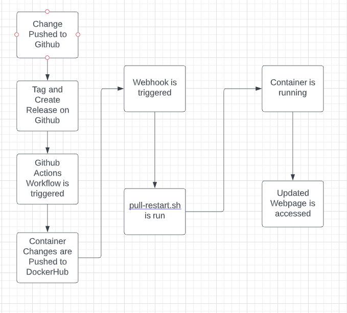

## Project Overview
In this project I will be completing the following tasks:  

- Containerize an application with Docker
- Automate the project pipeline with GitHub Actions
- Explore usage of webhooks to keep production up to date

## Part 1 - Dockerize it

### Documentation

- Run Project Locally
  - how you installed docker + dependencies (WSL2, for example)
    1. I am installing docker on an ubuntu aws instance.
    3. I ran the following command
        > sudo apt-get update  
    4. I ran the following command
        > sudo apt-get install \\  
    ca-certificates \\  
    curl \\  
    gnupg \\
    5. I ran the following command
        >   curl -fsSL https://download.docker.com/linux/ubuntu/gpg | sudo gpg --dearmor -o /usr/share/keyrings/docker-archive-keyring.gpg
    6. I ran the following command.
        > echo \\  
  "deb [arch=$(dpkg --print-architecture) signed-by=/usr/share/keyrings/docker-archive-keyring.gpg] https://download.docker.com/linux/ubuntu \
  $(lsb_release -cs) stable" | sudo tee /etc/apt/sources.list.d/docker.list > /dev/null
    lsb-release
    8. I ran the following command
        > sudo apt-get update
    9. I ran the following command
        > sudo apt-get install docker-ce docker-ce-cli containerd.io
    10. I added the ubuntu user to the docker group with the following  2 commands
        > sudo usermod -a -G docker ubuntu  
        > newgrp docker
  - how to build the container
    - I created a docker file with the following text
        > FROM httpd:2.4  
        > WORKDIR /home/ubuntu/cicd-3120-pittman31/website  
        >COPY * /usr/local/apache2/htdocs/  
        >EXPOSE 80
    - I ran the following command to build the container
        > docker build -t apache-server:4.0 /home/ubuntu/cicd-3120-pittman31/Projects/Project5
  - how to run the container
    - I ran the following command to run my container
        >  docker run -d --name ApacheServer -p 80:80 apache-server:4.0
  - how to view the project (open a browser...go to ip and port...)
    - I viewed the project by entering my public ip for the instance in the web browser
        > 44.196.112.55:80  

## Part 2 - GitHub Actions and DockerHub

### Documentation  
- Create DockerHub public repo
  - process to create  
    1. Login to Docker Hub
    2. Click on repositories along the top banner
    3. Click the Create Repository Button
    4. Enter a name for the repository
    5. Verify that public is selected and click create
- Allow DockerHub authentication via CLI using Dockhub credentials  
  1. I entered the following command in the cli
    > docker login -u DOCKER_USERNAME
  2. I entered a docker authentication token when prompted
- Configure GitHub Secrets
  - what credentials are needed - DockerHub credentials (do not state your credentials)
    - Docker Username and authentication token are needed
  - set secrets and secret names
    1. Cicked on the settings button for https://github.com/WSU-kduncan/cicd-3120-pittman31
    2. Selected Environments from the side bar
    3. Clicked on New Respository Secret
    6. Enter Information for Username secret
    7. Repeat steps 3-4 for Password secret
- Configure GitHub Workflow
  - what does it do and when
    - When a new release is created, the workflow pushes the changes made to the contatiner to DockerHUB
  - variables to change (repository, etc.)
    1. I clicked add file on https://github.com/WSU-kduncan/cicd-3120-pittman31 repository and created .github/workflow/github-actions-project5.yml
    2. I copied the contents of the template on https://docs.github.com/en/actions/guides/publishing-docker-images#publishing-images-to-docker-hub into the github-actions-project5.yml file
    3. I changed images: my-docker-hub-namespace/my-docker-hub-repository to:
        > images: pittman31/ceg3120_project5
    5. I created a new release on github tagged as 1.0
    
## Part 3 - Deployment

### Documentation
- Container restart script
  - what it does
    1. Stops the container if it is currently running
    2. Removes all unused containers from the system
    3. Pulls  pittman31/ceg3120_project5:latest
    4. runs pittman31/ceg3120_project5:latest
- Webhook task definition file
  - what it does
    - this defines what happens uppon the webhook triger and how to trigger that webhook.
    - I changed the following line from the default json file from this resource https://blog.devgenius.io/build-your-first-ci-cd-pipeline-using-docker-github-actions-and-webhooks-while-creating-your-own-da783110e151
      > "id": "project5",  
      > "execute-command": "./pull-restart.sh",  
      > "command-working-directory": "/home/ubuntu/cicd-3120-pittman31",  
      > "response-message": "Executing redeploy ApacherServer container",  
      > "match":
      > {  
          &nbsp;&nbsp;&nbsp;&nbsp;"type": "value",  
          &nbsp;&nbsp;&nbsp;&nbsp;"value": "llama",  
          &nbsp;&nbsp;&nbsp;&nbsp;"parameter":  
          &nbsp;&nbsp;&nbsp;&nbsp;{  
            &nbsp;&nbsp;&nbsp;&nbsp;"source": "url",  
            &nbsp;&nbsp;&nbsp;&nbsp;"name": "GET-PARAM"  
          &nbsp;&nbsp;&nbsp;&nbsp;}  
        &nbsp;&nbsp;&nbsp;&nbsp;}   
- Setting up a webhook on the server
  - How you created you own listener
    - I created my own listener with the following command
      > /home/ubuntu/go/bin/webhook -hooks /home/ubuntu/cicd-3120-pittman31/webhook-config.json -verbose
  - How you installed and are running the [webhook on GitHub](https://github.com/adnanh/webhook)
    - I ran the commands below
      >  sudo snap install --classic go  
      >  go install github.com/adnanh/webhook@latest
- Setting up a notifier in GitHub or DockerHub
  - I created a webhook under the webhooks tab on DockerHub with the following url
    > http://44.196.112.55:9000/hooks/project5?GET-PARAM=llama  

## Part 4 - Diagramming

Include a diagram (or diagrams) of your entire workflow. Meaning it should start with a project change / update, the steps that happen in between, and end with the updated version when the server is queried (web page is accessed)  

